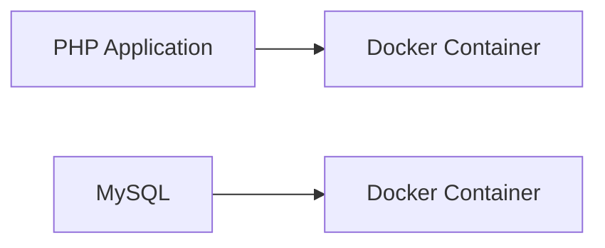

# SnipeIT

Snipe-IT is a free, open source IT asset management system written in PHP. With this docker-compose file, you can easily run Snipe-IT on your local machine.

## Architektur



Snipe-IT ist ein kostenloses, Open-Source-IT-Asset-Management-System, das in PHP geschrieben ist. Mit diesem Docker-Compose-File können Sie Snipe-IT einfach auf Ihrem lokalen Rechner ausführen.

## Usage

### Start the container

First, clone the repository and then run the following command:

```bash
docker compose up -d
```

- Open the browser and go to `http://localhost:8080`. 
- To get access to the mailhog, go to `http://localhost:8025`.

### Restart the container

```bash
docker compose down && docker compose up -d
```

### Generate app key

```bash
docker compose run --rm app php artisan key:generate --show
```

---

## Hosting

### Webhosting

- Das Betriebssystem wird durch den Hoster Verwaltet
- Update von PHP und MySQL wird durch den Hoster Verwaltet
- Kein Zugriff auf die Konsole
- Kein Zugriff auf die Datenbank
- Kein Zugriff auf die PHP Konfiguration

#### Beispiel Hoster Webhosting

- [1&1](https://www.1und1.de/)
- [Strato](https://www.strato.de/)
- [HostEurope](https://www.hosteurope.de/)
- [All-Inkl](https://all-inkl.com/)
- [DomainFactory](https://www.df.eu/)
- [GoDaddy](https://de.godaddy.com/)

### VPS - Virtual Private Server

#### Merkemale

- Zugriff auf die Konsole
- Man ist selbst für die Updates von PHP und MySQL verantwortlich
- Zugriff auf die Datenbank
- Zugriff auf die PHP Konfiguration

#### Beispiel Hoster VPS

- <https://contabo.com/de/>
- <https://www.hetzner.de/>
- <https://www.netcup.de/>

### Cloud Hosting

#### Merkemale des Cloud Hostings

- Zugriff auf die Konsole
- Man ist selbst für die Updates von PHP und MySQL verantwortlich
- Zugriff auf die Datenbank
- Zugriff auf die PHP Konfiguration
- Skalierbar
- Hohe Verfügbarkeit
- Hohe Sicherheit
- Hohe Performance
- Pay as you go
- Erhöhte Komplexität (Kosten, Sicherheit, Performance, Skalierbarkeit)
- IaC (Infrastructure as Code) mit Terraform, CloudFormation, Ansible, Puppet, Chef, Salt, etc.

### On-Premise

#### Merkemale on-Premise

- Man ist selbst für die Updates der Hardware verantwortlich.
- Man ist selbst für die Updates der Software verantwortlich.
- Man ist für die Datensicherheit verantwortlich.
- Man ist für die Performance verantwortlich.
- Im Vergleich zum Cloud-Hosting ist die Skalierbarkeit begrenzt.

### Docker Hosting

Verschieden Varianten von Docker Hosting:

1. On-Premise Docker Hosting
2. Cloud Docker Hosting (z.B. AWS ECS, Azure Container Instances, Google Cloud Run)
3. VPS mit installiertem Docker
4. Docker Hosting Provider (z.B. DigitalOcean, Linode, Vultr, Hetzner Cloud, Contabo)

#### Vorteile des Docker Hostings der verschiedenen Varianten

- Isolation der Anwendungen
- Einfache Bereitstellung von Anwendungen
- Einfache Skalierbarkeit
- Einfache Wartung
- Einfache Migration
- Einfache Sicherung
- Einfache Wiederherstellung
- Einfache Integration in CI/CD Pipelines

#### Vorteile des Docker-Images

Das Docker-Image von SnipeIT enthält alles, was benötigt wird, um SnipeIT zu betreiben. Das Docker-Image enthält Apache, PHP mit den notwendigen Extensions und SnipeIT ansich.

## Docker kurz erklärt

### Dockerfile

Ein Dockerfile ist eine Textdatei, die Anweisungen enthält, die Docker verwenden kann, um ein Docker-Image zu erstellen. Ein Dockerfile enthält Anweisungen, die Docker verwenden kann, um ein Docker-Image zu erstellen. Ein Docker-Image ist eine ausführbare Anwendung, die alle benötigten Abhängigkeiten enthält, einschließlich des Betriebssystems, der Bibliotheken, der Tools und der Laufzeitumgebung.

#### Beispie Dockerfile

Die einzelenen Schritte in einem Dockerfile sind wie Schichten in einem Kuchen. Jede Schicht fügt dem Docker-Image etwas hinzu.
Die Schichten werden gecached, so dass sie bei der nächsten Ausführung des Dockerfiles nicht erneut ausgeführt werden müssen.

```dockerfile
# Use the official PHP image
FROM php:7.4-apache
# Install the necessary extensions
RUN docker-php-ext-install pdo_mysql
# Copy the application files
COPY . /var/www/html
# Set the working directory
WORKDIR /var/www/html
# Expose the port
EXPOSE 80
# Start the Apache server
CMD ["apache2-foreground"]
```

### Docker-Image

Ein Docker-Image ist eine ausführbare Anwendung, die alle benötigten Abhängigkeiten enthält, einschließlich des Betriebssystems, der Bibliotheken, der Tools und der Laufzeitumgebung.

### Docker-Container

Ein Docker-Container ist eine *Instanz* (gestartetes Docker Image) eines Docker-Images. Ein Docker-Container enthält eine ausführbare Anwendung, die alle benötigten Abhängigkeiten enthält, einschließlich des Betriebssystems, der Bibliotheken, der Tools und der Laufzeitumgebung.

### Docker-Compose

Docker-Compose ist ein Tool, mit dem Sie mehrere Docker-Container gleichzeitig erstellen, starten und stoppen können. Docker-Compose verwendet eine YAML-Datei, um die Konfiguration der Docker-Container zu definieren.

### Docker-Registry

Eine Docker-Registry ist ein privates Repository, in dem Docker-Images gehostet werden. Eine Docker-Registry enthält eine Vielzahl von Docker-Images, die von der Organisation erstellt wurden.

#### Docker-Hub

Docker Hub ist ein öffentliches Repository, in dem Docker-Images gehostet werden. Docker Hub enthält eine Vielzahl von Docker-Images, die von der Community erstellt wurden.


#### Beispiel Docker-Registries

- [AWS Elastic Container Registry (ECR)](https://aws.amazon.com/ecr/)
- [Google Container Registry (GCR)](https://cloud.google.com/container-registry)
- [Azure Container Registry (ACR)](https://azure.microsoft.com/en-us/services/container-registry/)
- [Docker Hub](https://hub.docker.com/)
- [GitHUb Container Registry](https://docs.github.com/en/packages/working-with-a-github-packages-registry/working-with-the-container-registry)
